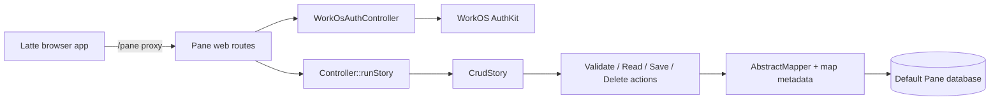
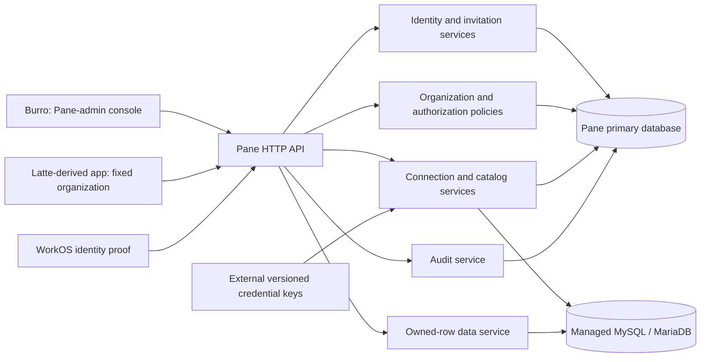
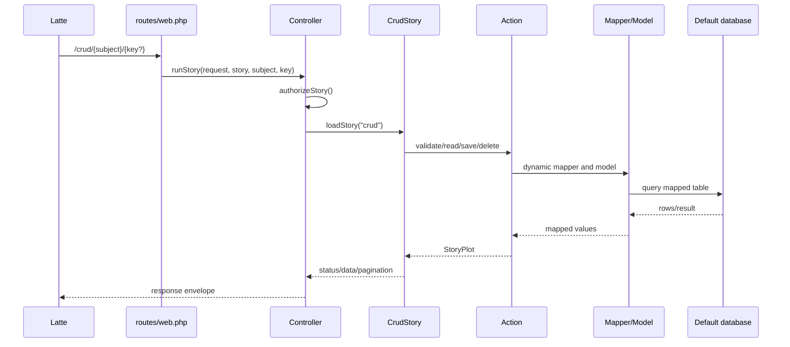
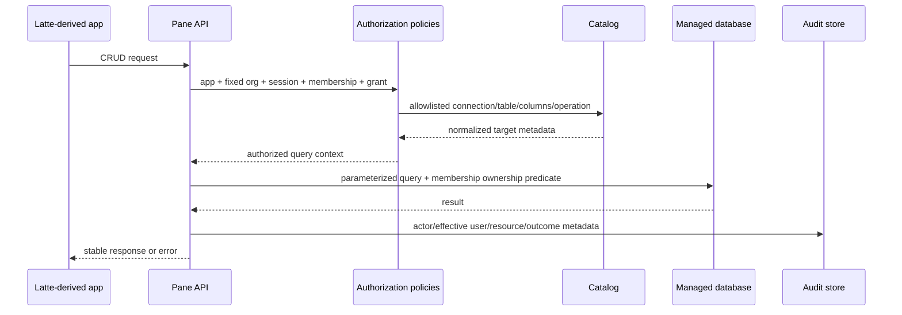

# Pane Architecture

Status: verified current architecture and agreed phase-one target

This document is the architectural entry point for Pane. It separates facts
verified in the current repository from the intended product architecture.
Code that matches the current architecture is not automatically the desired
long-term design. Future changes should move deliberately toward the target
without silently weakening current security contracts.

The corresponding frontend product decisions are recorded in the
[Pane, Latte, and Burro product architecture](https://github.com/erme2/Latte/blob/main/docs/product-architecture.md).
A separate Burro application is planned to be created from Latte as Pane's
private administrator console.

## Architectural status labels

This document uses three labels:

- **Current:** verified in the repository at the time of writing.
- **Target:** an explicit phase-one decision that future work should preserve.
- **Unresolved:** deliberately deferred and not safe to infer from current code.

## System context

### Current

Pane is a Laravel application that exposes WorkOS-backed browser authentication
and metadata-driven CRUD over its one configured default database. The current
Latte React application owns the browser login experience and proxies requests
to Pane.



There is no organization model, application registration, invitation model,
connection vault, dynamic target-connection registry, system-catalog discovery,
connection grant, row-ownership policy, impersonation model, or audit-event
store in the current code.

### Target

Pane becomes an independently installable, multi-organization data-access
control plane. Every installation is an atomic universe with its own users,
organizations, applications, sessions, encryption keys, connections, catalogs,
settings, and audit history. Pane installations never discover or communicate
with one another.



Pane is authoritative for authentication state, organization membership,
authorization, invitations, quotas, connection secrets, catalog descriptions,
row ownership enforcement, impersonation, and auditing. Frontends never receive
database credentials and never connect directly to a managed database.

## Product boundaries

### Pane owns

- installation-local user identities and WorkOS identity linkage;
- Pane-admin and organization invitation lifecycle;
- organizations, memberships, roles, status, and settings;
- application registration, trusted origins, redirects, and fixed organization
  binding;
- organization database limits and connection lifecycle;
- encrypted connection credentials and installation egress policy;
- MySQL/MariaDB catalog discovery and Pane-owned descriptions;
- connection-level grants and owned-row CRUD authorization;
- Laravel sessions, CSRF enforcement, impersonation, and audit history;
- stable API responses and error semantics.

### Pane does not own

- frontend presentation or product-specific workflows;
- cross-installation identity, discovery, or administration;
- WorkOS authentication UI;
- database server, logical database, table, index, or migration provisioning;
- direct browser-to-database access;
- arbitrary SQL supplied by a frontend;
- phase-one third-party databases or data ownership inference;
- frontend-only authorization decisions.

Latte is the reusable frontend template. Burro is the private Pane-admin
console. Each Latte-derived deployment owns its organization-specific product
and organization-admin UI, but Pane remains the authorization authority.

## Current component map

| Area | Authoritative current locations | Current responsibility |
| --- | --- | --- |
| HTTP routes | `routes/web.php` | Public auth routes and authenticated dynamic story/subject routes |
| Request entry | `app/Http/Controllers/Controller.php` | Dispatches stories and applies current CRUD role checks |
| WorkOS callback | `app/Http/Controllers/Auth/WorkOsAuthController.php` | OAuth state, code exchange orchestration, user sync, Laravel login |
| WorkOS API | `app/Services/WorkOsService.php` | AuthKit URLs, code exchange, logout URL, required config |
| Story orchestration | `app/Stories/AbstractStory.php`, `CrudStory.php`, `StoryPlot.php` | Converts HTTP methods to ordered actions and carries response state |
| CRUD actions | `app/Actions/ReadAction.php`, `SaveAction.php`, `DeleteAction.php`, `ValidateAction.php` | Current default-database reads, validation, writes, and deletes |
| Dynamic loading | `app/Helpers/StoryHelper.php`, `ActionHelper.php` | Resolves story/action classes and constructs dynamic models/mappers |
| Mapping | `app/Mappers/AbstractMapper.php`, `app/Helpers/MapperHelper.php`, `ModelHelper.php` | Reads Pane map metadata, builds validation, maps values and table names |
| Dynamic models | `app/Models/AbstractModel.php`, `Field.php`, `FieldValidation.php`, `ValidationType.php` | Eloquent access to mapped tables and metadata |
| User model | `app/Models/User.php` | Current local authenticated identity |
| Map schema | `database/migrations/2023_10_09_192202_pane_system_tables.php` | Creates and seeds table, field, type, and validation maps |
| Auth schema | `database/migrations/2023_10_15_061423_pane_auth_tables.php`, `2026_06_23_191411_add_workos_columns_to_users_table.php` | Current users, user types, and WorkOS linkage |
| Response shape | `app/Helpers/ResponseHelper.php`, `app/Exceptions/Handler.php` | Success and exception response envelopes |
| Browser security | `app/Http/Kernel.php`, `VerifyCsrfToken.php`, `TrustHosts.php` | Sessions, cookies, CSRF, CORS integration, trusted hosts |
| Configuration | `config/database.php`, `auth.php`, `session.php`, `cors.php`, `services.php`, `app.php` | Static environment-backed runtime configuration |
| Local runtime | `docker-compose.yml`, `Dockerfile`, `.env.docker` | PHP-FPM backend service and one MariaDB service |
| Tests | `tests/Unit`, `tests/Feature`, `.github/workflows/pr-tests.yml` | Isolated contracts, database-backed behavior, static analysis, PR validation |

## Current request flows

### WorkOS login and session creation

The complete verified browser sequence is in
[WorkOS and Latte Authentication](workos-latte-auth.md).

1. Latte requests `GET /auth/login-url` through its Pane proxy.
2. `WorkOsAuthController::loginUrl()` creates OAuth state and stores it in the
   Laravel session and a short-lived HTTP-only cookie.
3. `WorkOsService::authorizationUrl()` constructs the WorkOS AuthKit URL.
4. WorkOS returns the browser to Latte.
5. Latte posts the code and state to `POST /auth/callback`.
6. `WorkOsAuthController::completeCallback()` validates state and calls
   `WorkOsService::authenticateWithCode()`.
7. `WorkOsAuthController::syncUser()` finds or creates a local user by WorkOS ID
   or email and activates that user.
8. Laravel Auth creates the session and the session ID is regenerated.
9. Subsequent requests use the Pane session cookie.

**Current limitation:** successful WorkOS authentication can create a user
without a Pane invitation. Roles are represented by `user_type_id`, and there
are no organization memberships.

### Generic CRUD



`routes/web.php` accepts `GET` and `POST` on `/{story}/{subject}` and `GET`,
`PUT`, and `DELETE` on `/{story}/{subject}/{key}` behind Laravel's `auth`
middleware. `StoryHelper` constructs a story class from the URL. `CrudStory`
selects actions from the HTTP method.

`ActionHelper` creates an anonymous `AbstractMapper` and an `AbstractModel` for
the subject. `ModelHelper` and the map tables resolve the physical table,
primary key, fields, types, and validation. All reads and writes use Laravel's
configured default connection.

`Controller::authorizeStory()` protects Pane map/auth subjects from ordinary
users and permits CRUD mutations only to users whose `user_type_id` is `1`.
Ordinary authenticated users may read all rows of non-system subjects. There
is no organization, connection, or row-ownership predicate. `DeleteAction`
performs the model's normal physical delete.

### Current metadata

The current map is not discovered from a database system catalog.
`2023_10_09_192202_pane_system_tables.php` creates and seeds map tables for
tables, fields, field types, field validations, and validation types. Later
migrations explicitly add auth and test table descriptions. `Field` and
`MapperHelper` read these records at request time.

The map currently acts as runtime CRUD configuration and validation metadata.
It does not identify an organization, application, managed connection, schema,
catalog refresh, missing object, or row-ownership rule.

## Current persistence and configuration

Pane uses the default connection selected by `DB_CONNECTION` in
`config/database.php`. Laravel configuration includes SQLite, MySQL,
PostgreSQL, and SQL Server definitions, but the application has no persisted
managed-connection registry or per-request connection selection. The current
Pane system tables, users, mapped application tables, and CRUD data share the
default database.

`DB_TABLE_PREFIX` prefixes Pane's `map_` system and auth tables. It is a naming
convention inside the default database, not a tenant or connection-isolation
boundary.

WorkOS, frontend, database, session, host, and cookie configuration comes from
environment variables mapped through Laravel config. The authoritative list is
in [Environment Configuration](environment.md).

The local Docker stack in `docker-compose.yml` runs Pane's PHP-FPM backend and
one MariaDB service on one Docker network. Browser-facing Nginx/TLS and
`/pane` proxying are owned by each Latte-derived frontend. This is a
development topology, not the target dynamic managed-database design.
`bash/refresh.sh` can destructively recreate the configured development or test
database; it is not a managed data-source lifecycle operation.

## Current security and trust boundaries

- WorkOS proves identity; Pane validates OAuth state and owns code exchange.
- Pane owns the Laravel session and does not retain WorkOS access or refresh
  tokens after login.
- `auth` middleware protects CRUD routes.
- Laravel web middleware applies session and CSRF protection. Only
  `POST /auth/callback` is CSRF-exempt because Pane validates OAuth state.
- Latte must forward cookies and the encrypted `XSRF-TOKEN` value as
  `X-XSRF-TOKEN` for mutating requests.
- `TrustHosts` validates request hosts outside local/test environments.
- CORS allows one environment-configured frontend origin and credentials.
- Production boot rejects debug mode and insecure session-cookie settings.
- Current authorization is a coarse numeric administrator check, not target
  multi-tenant policy enforcement.
- Current exception responses may contain file, line, and trace only when debug
  is enabled outside production.

## Target domain and state ownership

The Pane primary database owns:

- users and WorkOS identity linkage;
- Pane administrators;
- organizations and unique organization slugs;
- organization memberships, roles, status, and stable membership UUIDs;
- organization and Pane-admin invitations;
- typed installation settings and organization overrides;
- registered frontend applications and their fixed organization binding;
- organization database limits;
- data-source metadata and separately encrypted secret records;
- connection grants;
- discovered catalog snapshots and human descriptions;
- impersonation sessions;
- append-only audit events.

Pane must never store:

- WorkOS access or refresh tokens after login;
- plaintext managed-database credentials;
- plaintext invitation tokens;
- complete managed-database rows as an audit substitute;
- secrets in logs, exceptions, queued payloads, or audit events;
- data or identities shared between Pane installations.

Managed MySQL/MariaDB databases own their physical schemas and product rows.
WorkOS owns external authentication. Versioned credential keys live outside
the Pane primary database and are separate from Laravel's `APP_KEY`.

## Target tenancy and roles

One Pane installation may contain many unrelated organizations. A user may
belong to several organizations, but each invitation and membership is scoped
to exactly one organization. Ordinary users cannot discover organizations for
which they lack an accepted active membership.

Roles are:

- **Pane administrator:** operates organizations, limits, Pane admins, first
  organization-admin invitations, audit, and impersonation through Burro;
- **Organization administrator:** manages members, connections, grants,
  catalog, descriptions, and all rows for one organization;
- **Organization user:** uses explicitly granted connections and CRUDs only
  rows owned by that organization membership.

Pane administrators must impersonate an organization administrator or user to
change organization-scoped connections, memberships, grants, descriptions, or
data. Direct Pane-admin operations are limited to installation and organization
lifecycle responsibilities.

Membership removal is suspension. It preserves the stable membership UUID and
owned rows. Reinvitation reactivates the existing membership. The final active
Pane administrator and final active organization administrator cannot be
removed or demoted.

## Target frontend application boundary

Burro is registered to one Pane installation and is visible only to Pane
administrators.

Every Latte-derived application deployment is registered with one Pane
installation and permanently bound to one organization. The organization ID is
trusted application configuration, not a browser-selected parameter. The
application cannot list, resolve, switch to, or reveal another organization.

Several applications may bind to the same organization. The user's membership
and connection grants work across those applications. There are no
application-specific connection grants in phase one.

Pane validates the application registration, trusted origin and redirect,
fixed organization, active membership, role, connection grant, operation, and
row ownership. Frontend visibility is never an authorization control.

Every organization-scoped API route carries an explicit organization
identifier. Pane resolves the calling application's registered organization
and rejects the request when the route organization does not match it. The
route value provides explicit server-side scope; it never allows the browser or
a Latte-derived application to discover or switch organizations.

## Target invitations and settings

Pane owns invitations; WorkOS only proves the recipient's identity.
Organization invitations are single-use, organization-specific, email-bound,
hashed, revocable, resendable, and audited. The verified WorkOS email must match
the invited email. Resending invalidates the earlier token.

Organization invitations expire after seven days by default. Pane-admin
invitations expire after 24 hours by default. Typed settings resolve as:

1. organization override, when allowed;
2. installation override;
3. versioned code default.

Organization administrators may override organization invitation expiry within
Pane-admin-defined bounds. Pane-admin invitation expiry is installation-only.
Unregistered or incorrectly scoped settings are rejected.

The first Pane administrator is created by a server-side installation command.
Later Pane administrators are invited by existing Pane administrators.

## Target organization lifecycle and quotas

Organizations are `active`, `suspended`, or `closed`. Suspension and closure
immediately block invitations, connections, and organization APIs while
preserving configuration and audit history. Pane administrators may reopen
suspended or closed organizations in phase one. Permanent erasure is deferred.

Pane administrators set an organization database limit. One active logical
database connection consumes one unit. Lowering a limit below current usage
preserves existing connections and blocks creation or reactivation until usage
returns within the limit.

## Target managed connections

Phase one supports product-controlled MySQL and MariaDB databases. One data
source represents one logical database. Pane does not provision its server,
database, tables, columns, indexes, or migrations.

A data source stores non-secret engine, name, description, host, port, database,
username, TLS mode, status, organization, and audit metadata. Password and
private certificate material are encrypted separately with a dedicated,
versioned installation key outside Pane's database and separate from
`APP_KEY`. Secrets are write-only through the API.

Each connection uses a dedicated account restricted to its configured database
with required catalog reads and `SELECT`, `INSERT`, `UPDATE`, and `DELETE`, but
without DDL, file, grant, user-management, server-administration, or
other-database privileges.

Pane-admin installation settings define egress policy. Loopback, link-local,
multicast, cloud metadata, and private networks are denied by default. Explicit
CIDR or host allow rules enable required private networks. Pane validates DNS
resolution and rebinding and applies strict connection and query timeouts.

## Target catalog discovery

```mermaid
sequenceDiagram
    participant OA as Organization admin
    participant P as Pane
    participant I as information_schema
    participant C as Pane catalog store

    OA->>P: Test or refresh connection
    P->>P: Validate organization, quota, egress, TLS, privileges
    P->>I: Read configured logical database metadata
    I-->>P: Schemas/tables/columns/keys/relationships
    P->>P: Normalize and validate identifiers and table contract
    P->>C: Upsert discovered snapshot; preserve descriptions
    C-->>OA: Catalog status and compatibility results
```

The connected database is authoritative for physical structure. Pane queries
MySQL/MariaDB `information_schema` and normalizes schemas, tables, columns,
primary keys, and relationships into catalog records in its primary database.

Refresh adds new objects and updates structural metadata without overwriting
descriptions. Missing objects are marked missing instead of immediately
deleted. Phase one treats a rename as a missing old object and a new object.
Description updates use optimistic concurrency and are audited.

Only explicitly enabled tables satisfying the phase-one CRUD contract are
available to standard users.

## Target grants, table contract, and CRUD

Organization administrators have implicit full access to every organization
connection. Standard users have no connection access by default. Organization
administrators assign connection-level Viewer, Editor, or Manager grants:

- Viewer reads catalog, descriptions, and owned rows;
- Editor also creates and updates owned rows and edits descriptions;
- Manager also soft-deletes owned rows.

Each phase-one user-owned table requires one single-column primary key, a
non-null indexed immutable `pane_membership_id` UUID, `created_at`, `updated_at`,
and nullable `deleted_at` timestamps.



Pane injects the authenticated membership UUID on create. Reads, updates, and
deletes add an ownership predicate for standard users. Standard users cannot
set or change row ownership. Organization administrators may access all rows in
their organization's connections.

Delete is soft deletion. Normal reads hide deleted rows. Organization
administrators may inspect and restore them. `updated_at` provides optimistic
concurrency. Pane accepts only catalog-allowlisted identifiers and parameterized
values; it never accepts raw SQL.

## Target authentication, sessions, and CSRF

The current server-owned OAuth state, WorkOS code exchange, session
regeneration, credentialed browser request, and CSRF contracts remain target
invariants.

The target callback differs in one essential way: successful WorkOS identity
proof does not automatically authorize registration. Pane creates or activates
access only for a bootstrapped Pane administrator, an existing active identity,
or a valid matching invitation. Organization selection cannot come from
untrusted callback or browser state; it comes from the fixed application and
accepted membership.

Pane never calls WorkOS for every CRUD request. The Laravel session identifies
the local user. Every organization operation still rechecks application,
organization, membership, and authorization state so suspension or revocation
takes effect immediately.

## Target API ownership and errors

Pane validates all identifiers, input types, organizations, memberships,
applications, grants, table contracts, ownership, quotas, connection policy,
and concurrency tokens. Latte-derived applications perform usability
validation but cannot replace Pane validation.

Pane returns stable machine-readable error codes and safe messages. Frontends
own presentation and recovery UI. Pane owns HTTP status, validation details,
authorization decisions, and request correlation IDs. Secrets, SQL, internal
host details, source paths, and stack traces never appear in production errors.

The phase-one contract uses `/api/v1`, UUID organization identifiers, explicit
`/organizations/{organization_id}` route scope, and a globally unique trusted
browser origin to bind the registered application into Pane's server-side
session at login. Authenticated requests reload that active registration from
the session, while mutations revalidate the origin. The exact route matrix,
verification order, schemas, envelopes, statuses, errors, and legacy migration policy are defined in
[Pane Phase-One HTTP API](api-v1.md) and its machine-readable
[`contracts/pane-v1.json`](../contracts/pane-v1.json) fixture. Pane verifies the
application and fixed organization before resolving an organization-owned
resource.

## Impersonation and auditing

Only Pane administrators may impersonate organization administrators or users;
they cannot impersonate another Pane administrator. Impersonation requires a
reason, has a short expiry, cannot renew silently, and produces a persistent UI
banner and exit path. Credential operations remain unavailable.

Audit events preserve the real actor and effective user, organization, action,
outcome, resource identifiers, connection/table/row key where applicable,
changed column names, request ID, IP address, user agent, timestamp, and
impersonation session. They exclude secrets, invitation tokens, certificates,
and complete row values.

Pane administrators see installation history through Burro. Organization
administrators see their organization's history through their Latte-derived
application. Phase one retains audit events indefinitely.

## Extension boundaries

New capabilities beyond CRUD should enter through explicit application/domain
services and authorization policies. They may reuse catalog and managed
connection abstractions but must not bypass organization isolation, connection
grants, row ownership, egress checks, secret handling, or auditing.

New data-source drivers implement a driver contract for connection validation,
privilege inspection, catalog discovery, identifier quoting, type mapping, and
query execution. MySQL and MariaDB are the only phase-one drivers. A new driver
must not add conditionals throughout controllers or expose raw driver objects to
frontends.

Whether current Story/Action/Mapper classes are adapted, wrapped, or replaced
is intentionally left to later implementation tickets. Their current behavior
does not override the target boundaries in this document.

## Testing boundaries

Current test placement is authoritative until a migration ticket changes it:

- `tests/Unit` contains isolated behavior without Laravel database-backed
  dependencies;
- `tests/Feature` contains HTTP, middleware, session, migration, mapper, action,
  and database-backed behavior;
- `.github/workflows/pr-tests.yml` runs Larastan and the full test suite;
- [Testing](testing.md) documents environment and database refresh behavior.

Target work should add:

- unit tests for typed settings, policies, value objects, encryption envelopes,
  driver normalization, and error mapping;
- feature tests for invitations, memberships, fixed application binding,
  quotas, grants, suspension, impersonation, and audit behavior;
- MySQL/MariaDB integration tests for privilege checks, catalog discovery,
  identifier handling, row ownership, soft deletion, and concurrency;
- contract tests shared with Latte/Burro for authentication, CSRF, response
  envelopes, and error codes;
- security regression tests proving cross-organization, cross-connection,
  cross-application, and cross-membership access is denied.

Tests that merely preserve current behavior must not be treated as evidence
that the current behavior matches the target.

## Current-to-target gap map

| Current | Target | Ticket boundary |
| --- | --- | --- |
| WorkOS callback auto-creates users | Invite-only access and Pane-admin bootstrap | Identity and invitation epic |
| Numeric `user_type_id` | Pane admins plus organization-scoped membership roles | Roles and membership epic |
| One environment-selected default database | Pane primary store plus encrypted managed connections | Connection-vault epic |
| Migration-seeded `map_*` metadata | `information_schema` discovery plus Pane descriptions | Catalog epic |
| Dynamic `/{story}/{subject}` API | Explicit safe APIs with fixed app/organization context | API contract epic |
| Administrator-only mutations | Connection grants and membership-owned CRUD | Authorization epic |
| Ordinary reads return all rows | Server-enforced membership ownership predicate | Row-ownership epic |
| Physical model delete | Soft deletion and restoration | CRUD lifecycle epic |
| One configured frontend origin | Registered apps, each fixed to one organization | Application registry epic |
| No organization quotas or lifecycle | Limits plus active/suspended/closed status | Organization epic |
| No credential encryption service | Dedicated versioned external key | Secrets epic |
| No egress policy | Pane-admin allow rules and safe defaults | Network-policy epic |
| No impersonation | Audited Pane-admin-only impersonation | Support-access epic |
| No audit event store | Append-only installation and organization history | Audit epic |

## Known constraints and deferred decisions

- Versioned phase-one API paths are fixed by `contracts/pane-v1.json`; later
  versions require a new contract and explicit compatibility policy.
- The implementation migration strategy for Story/Action/Mapper and `map_*`
  tables is unresolved and must be ticketed explicitly.
- Phase one excludes arbitrary third-party databases and ownership inference.
- Phase one excludes PostgreSQL and SQL Server as managed data sources even
  though Laravel currently has static configuration examples for them.
- One managed connection exposes one logical database.
- Phase one requires a single-column primary key and the controlled ownership,
  timestamp, and soft-delete columns.
- Composite keys, table-level grants, hard-delete workflows, permanent erasure,
  schema provisioning, catalog rename detection, KMS/Vault integration, and
  configurable audit retention are deferred.
- Invitation expiry bounds are controlled by Pane administrators but their
  exact minimum and maximum values are unresolved.
- The Latte repository transition is complete; the future Burro admin console
  split requires its own migration plan.

## Invariants and forbidden dependencies

- One Pane installation never reads another Pane installation's state.
- Every Latte-derived application is fixed to one organization.
- Every organization-scoped API route identifies that organization explicitly,
  and it must match the calling application's fixed organization.
- A browser never chooses or overrides that application organization.
- Organization resources are never resolved without organization ownership and
  active membership checks.
- Frontends never receive managed-database credentials or raw connection
  objects.
- Managed data queries never use client-supplied raw SQL or unlisted
  identifiers.
- Standard users never CRUD rows owned by another membership.
- WorkOS identity proof never bypasses Pane invitation and membership policy.
- Pane-admin organization-data changes always occur through impersonation.
- Secrets never enter logs, audit events, errors, frontend state, or database
  backups without authenticated encryption.
- New capabilities never bypass centralized policies, catalog validation,
  egress policy, or auditing.

## Before making changes

1. Identify whether the change affects verified current behavior, target design,
   or the migration between them.
2. Locate the authoritative current files in the component map.
3. Check the relevant invariant and trust boundary before designing the change.
4. Do not preserve accidental current behavior merely because a test encodes it.
5. Keep Pane primary state separate from managed-database data and secrets.
6. Add tests at the narrowest valid layer and include denial-path coverage for
   authorization or tenant changes.
7. Update this document when a target decision changes or a documented gap is
   completed.
8. Coordinate API contract changes with Latte/Burro documentation and tests.
